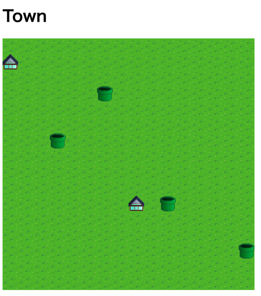

# Town Server

Server side Java application based on ERC721 NFT contract.

You can deploy contract to local eth network (truffle), and interact using truffle console. This
server application will show current contract status by visual.
